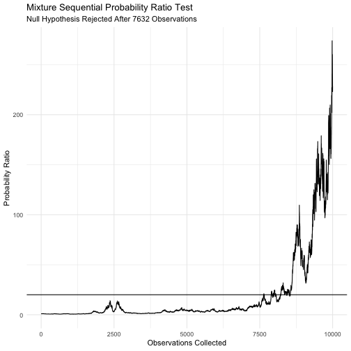

# mixtureSPRT

mixtureSPRT is a package for performing mixture Sequential Probability Ratio tests. It includes functions for calculating mixing variance and test statistic, as well as methods for plotting and printing. It also contains an option carry out the calculations in C++ as it reduced runtime substantially. This is particularly useful when many tests are performed to see for example sampling distributions or compare the mSPRT to other tests. 

- `calcTau()`
- `mSPRT()`


## Installation


```r
devtools::install_github("shitoushan/mixtureSPRT")
```

## Usage


```r
    set.seed(1337)
     n <- 10000
     m <- mSPRT(x = rnorm(n),
           y = rnorm(n, mean = 0.05),
           sigma = 1,
           tau =  calcTau(alpha = 0.05, sigma = 1, truncation = n),
           theta = 0,
           distribution = "normal",
           alpha = 0.05)

       plot(m)
```




### C++


```r
library(mixtureSPRT)
library(microbenchmark)

y <- rnorm(100)
x <- rnorm(100)
sigma = 1
tau = calcTau(0.05,1,100)
theta = 0
distribution="normal"
alpha=0.05

microbenchmark(
  m <- mSPRT(x,y,sigma,tau,
                     useCpp = F),
  mcpp <-  mSPRT(x,y,sigma,tau,
                         useCpp = T)
)
```

```
## Unit: microseconds
##                                         expr     min        lq      mean
##     m <- mSPRT(x, y, sigma, tau, useCpp = F) 812.872 1297.1905 1514.3622
##  mcpp <- mSPRT(x, y, sigma, tau, useCpp = T) 284.802  331.2365  447.4111
##     median        uq      max neval
##  1438.0315 1638.7975 4170.441   100
##   449.1175  504.2245  854.584   100
```
