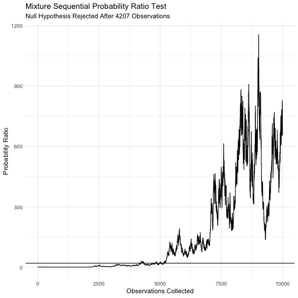

# mixtureSPRT
mixtureSPRT is a package for performing mixture Sequential Probability Ratio tests. It includes functions for calculating mixing variance and test statistic, as well as methods for plotting and printing. It also contains an option carry out the calculations in C++ as it reduced runtime substantially. This is particularly useful when many tests are performed to see for example sampling distributions or compare the mSPRT to other tests. 

- `calcTau()`
- `mSPRT()`


## Installation


```r
devtools::install_github("shitoushan/mixtureSPRT")
```

## Usage


```r
library(mixtureSPRT)
    set.seed(12345)
     n <- 10000
     m <- mSPRT(x = rnorm(n),
           y = rnorm(n, mean = 0.06),
           sigma = 1,
           tau =  calcTau(alpha = 0.05, sigma = 1, truncation = n),
           theta = 0,
           distribution = "normal",
           alpha = 0.05)
     
     print(m)
```

```
## Decision:  Accept H1 
## Decision made after 4207 observations were collected
```

```r
     plot(m)
```




### C++


```r
library(mixtureSPRT)
library(microbenchmark)

y <- rnorm(100)
x <- rnorm(100)
sigma = 1
tau = calcTau(0.05,1,100)
theta = 0
distribution="normal"
alpha=0.05

microbenchmark(
  m <- mSPRT(x,y,sigma,tau,
                     useCpp = F),
  mcpp <-  mSPRT(x,y,sigma,tau,
                         useCpp = T)
)
```

```
## Unit: microseconds
##                                         expr     min      lq     mean
##     m <- mSPRT(x, y, sigma, tau, useCpp = F) 620.943 666.018 865.1712
##  mcpp <- mSPRT(x, y, sigma, tau, useCpp = T) 244.179 291.176 351.4821
##    median        uq      max neval
##  705.6660 1113.3820 1339.248   100
##  314.3025  433.9505  564.184   100
```
