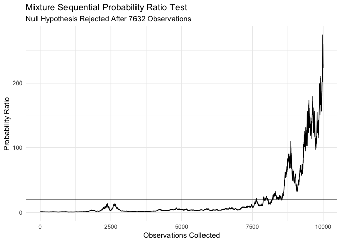
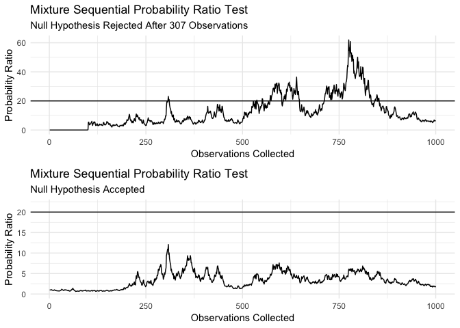

# mixtureSPRT

mixtureSPRT is a package for performing mixture Sequential Probability
Ratio tests. It includes functions for calculating mixing variance and
test statistic, as well as methods for plotting and printing. It also
contains an option carry out the calculations in C++ as it reduced
runtime substantially. This is particularly useful when many tests are
performed to see for example sampling distributions or compare the mSPRT
to other tests.

  - `calcTau()`
  - `mSPRT()`

## Installation

``` r
devtools::install_github("shitoushan/mixtureSPRT")
```

## Usage

``` r
    set.seed(1337)
     n <- 10000
     m <- mSPRT(x = rnorm(n),
           y = rnorm(n, mean = 0.05),
           sigma = 1,
           tau =  calcTau(alpha = 0.05, sigma = 1, truncation = n),
           theta = 0,
           distribution = "normal",
           alpha = 0.05)

       plot(m)
```

<!-- -->

### C++

``` r
library(mixtureSPRT)
library(microbenchmark)

y <- rnorm(100)
x <- rnorm(100)
sigma = 1
tau = calcTau(0.05,1,100)
theta = 0
distribution="normal"
alpha=0.05

microbenchmark(
  m <- mSPRT(x,y,sigma=sigma,tau=tau,
                     useCpp = F),
  mcpp <-  mSPRT(x,y,sigma=sigma,tau=tau,
                         useCpp = T)
)
```

    ## Unit: microseconds
    ##                                                       expr      min
    ##     m <- mSPRT(x, y, sigma = sigma, tau = tau, useCpp = F) 1025.595
    ##  mcpp <- mSPRT(x, y, sigma = sigma, tau = tau, useCpp = T)  298.758
    ##        lq     mean    median       uq       max neval
    ##  1281.853 1668.998 1373.2345 1610.736 13006.415   100
    ##   383.537  475.625  413.7475  524.851  1263.475   100

In case pre-experiment data is available, those can be included too as
control variates in order to reduce the variance in the variable tested.

``` r
library(MASS)
set.seed(1337)
rho=0.6 # Correlation between pre-experiment data and post-treatment data
sigma = 1
Sigma <- matrix(c(sigma^2,rho*sqrt(sigma^2*sigma^2),rho*sqrt(sigma^2*sigma^2),sigma^2),2,2) # covar.matrix to make sure correlation = rho
n <- 1000 # Truncation point

x <- mvrnorm(n = n, c(0,0.1), Sigma, empirical = T) %>% as.data.frame() # Treatment group
y <- mvrnorm(n = n, c(0,0), Sigma, empirical = T) %>% as.data.frame() # Control group
cor(x[,1],x[,2])
```

    ## [1] 0.6

``` r
cor(y[,1],y[,2])
```

    ## [1] 0.6

``` r
m1 <- mSPRT(x = x[,2],
      y = y[,2],
      xpre = x[,1],
      ypre = y[,1],
      sigma = sigma,
      tau = calcTau(alpha = 0.05, truncation = n, sigma = 1),
      theta = 0,
      distribution = "normal",
      alpha = 0.05,
      useCpp = T)

m2 <-  mSPRT(x = x[,2],
      y = y[,2],
      sigma = sigma,
      tau = calcTau(alpha = 0.05, truncation = n, sigma = 1),
      theta = 0,
      distribution = "normal",
      alpha = 0.05,
      useCpp = T)

gridExtra::grid.arrange(plot(m1),plot(m2))
```

<!-- -->
